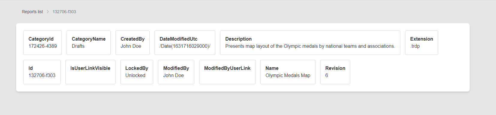

### Reportings application

The application to displays a wizard-like UI, consisting of three pages:

- Reports - list of available reports in table format. On every row is go to report details button.
- Export Format - lists all the export formats for the selected report.
- Result - downloads the selected report in the requested export format.

### Tech Stack

React, NextJS, Typescript, redux-toolkit, TailwindCSS, flowbite-react, heroicons

### Commands

- `pnpm i` - install dependencies
- `pnpm dev` run app locally (`localhost:3000`)
- `pnpm build` build app
- `pnpm lint` run lint

### Folder structure

```
/app               - main folder
  /segments        - app segments for 3 wizard's steps
    /exportFormat  - export format, second wizard step
    /reports       - list of reports, first wizard step
    /results       - download reports, third wizard step
  /api             - application endpoints. BE logic.
  /components      - shared components
  /hooks           - custom hooks
  /lib             -  utility functions, helper classes, or modules used across the application.
  /store           - redux toolkit store
  /types           - TypeScript types that are employed throughout the application.
```

### URL's

- http://localhost:3000 - starting point
- http://localhost:3000/reports/{id} - report details
- http://localhost:3000/api/reports - endpoint to fetch list of reports
- http://localhost:3000/api/reports/{id} - endpoint to fetch report by id

### Views





